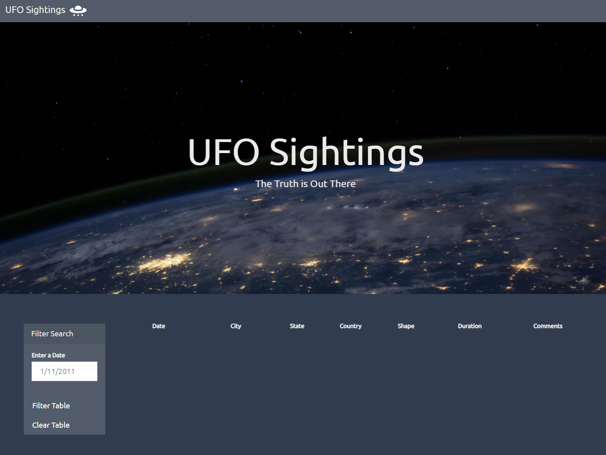
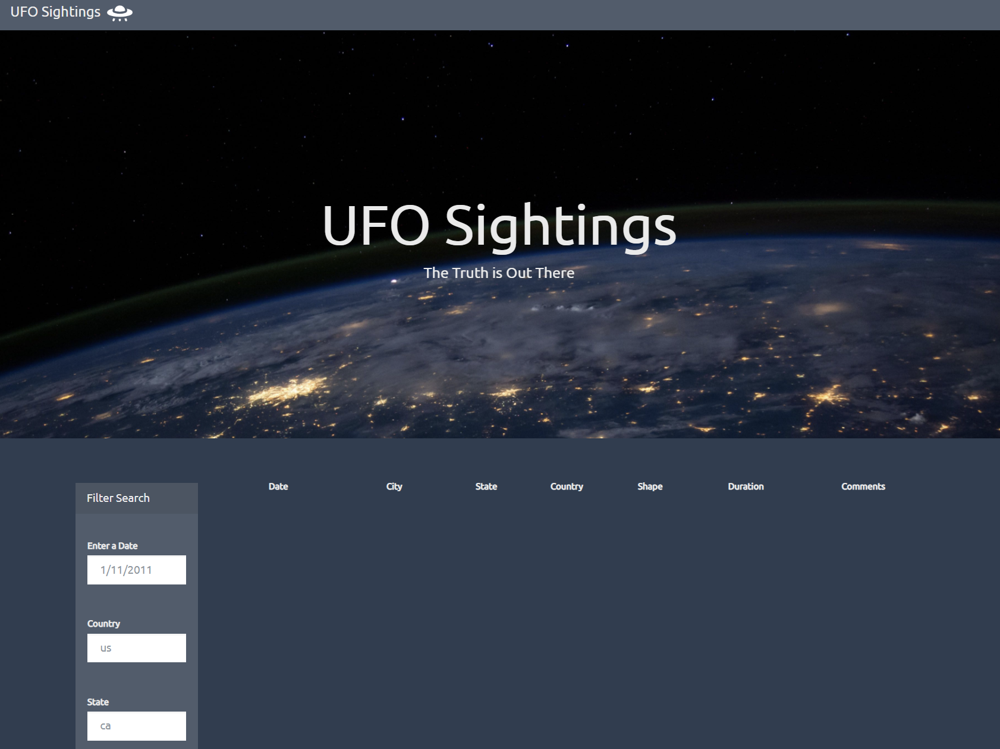
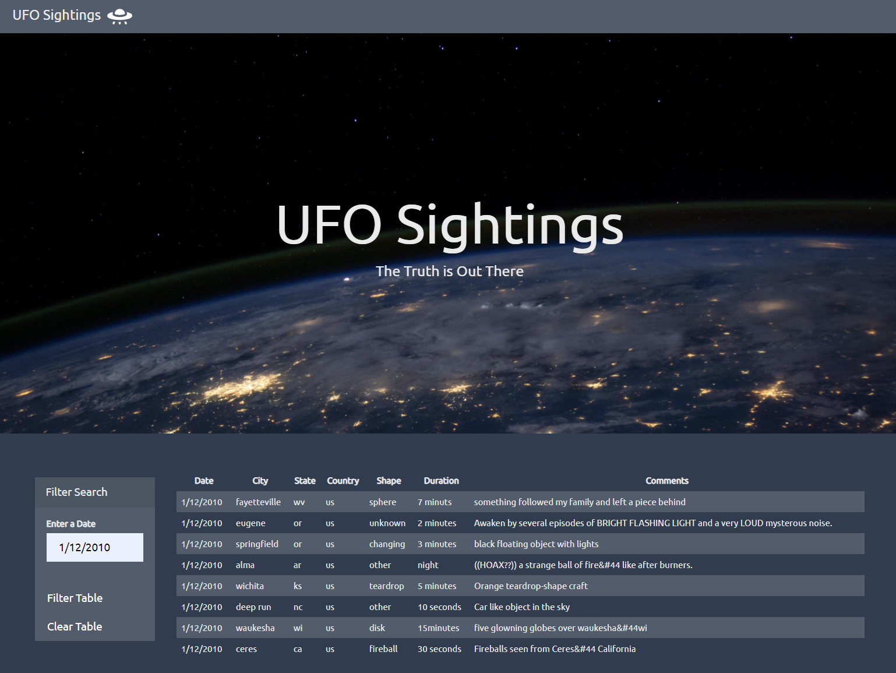
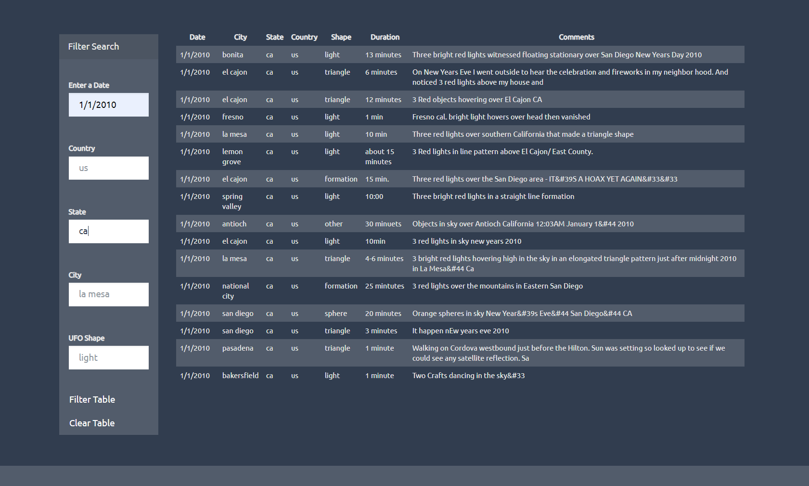
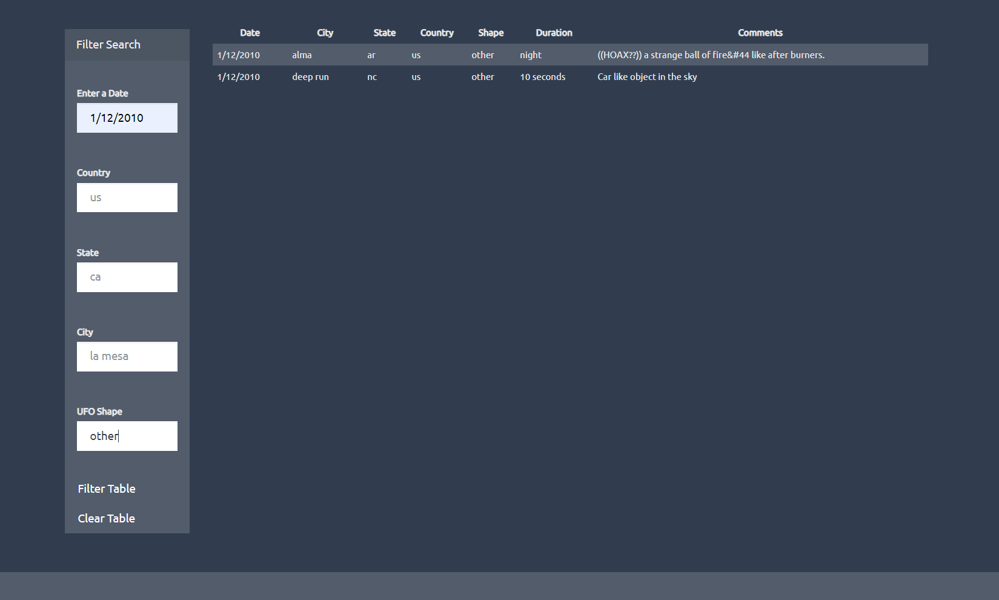

# UFO FINDER 
#### Aliens exist and occasionally they visit! :alien:

## Introduction

This project uses a javascript file to allow users to filter though records of UFO Sitings. Records a stored in the form of a javascript array and range from 1/1/2010 to 1/13/2010 for sitings over the USA. 

#### Level 1

Level 1 allows users to sort by date only. 

You can try out a demo of the script here: [Level 1](https://nikitacase.github.io/javascript-challenge/UFO-level-1/) 

And here's a screenshot

#### Level 2
Level 2 allows users to sort by date, country, state, city and shape of the UFO siting

You can try it out here: [Level 2](https://nikitacase.github.io/javascript-challenge/UFO-level-2/) 

And here's a screenshot: 

## Technologies Used

 * Javascript (including d3)
 
 * HTML5 
 
 * CSS (inclusing bootstrap) 
 
 
 
## Links
https://nikitacase.github.io/javascript-challenge/UFO-level-1/

https://nikitacase.github.io/javascript-challenge/UFO-level-2/ 

## Folder Structure

Levels 1 and 2 are separated into folders
Each contains: 
* index.html - main page layout, has links to the data file and the javascript file which is used to filter the data

* static folder

  * data.js contains records of sightings
  * app.js contains the functions which collects user input to filter UFO citings
  * style.css makes everything pretty

## Demo 

#### Level 1 

#### Level 2 

